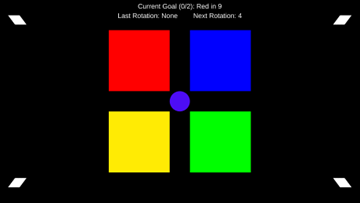

# Tasks and Distractions 2D #

## About the Game ##
This game is inspired by procrastinating and some common distractions in our lives. Your overarching goal is to achieve the simple task of being in the correct colored area, aka “Tasks”, while dodging various distractions that will try to push or pull you away from those Tasks. I apologize if you are color blind as this game does depend on color recognition.

This game was made with Unity version 2020.3.18f1.

## Objects ##
* Player: You are the purple circle that begins in the middle of the screen. Your only objective is to move around the playable area.

* Tasks: At the beginning of the game, four (4) squares will appear in the middle of the screen. Each square will be a different color, and your goal will be to stay in the Task with the same color that is designated at the top of the screen. Periodically, the color of each task will rotate, either clockwise or counterclockwise. You cannot directly collide with these objects. 

* Distractions: At the beginning of the game, four (4) diamonds will spawn on the corners of the screen. While you cannot collide with these objects nor can their transform translate across the playable area, they will continuously be looking at you. These are the objects you will aim to indirectly destroy (see How to Play) and can use to track your overall progress. Periodically, they will fire a Distractor at you. 

* Distractors: These are the projectiles the Distractions will fire at you. They have double the mass of the player, so they will assuredly move you if they collide with you. They can bounce off objects while losing minimal momentum. Distractors will go away by themselves after a period of time.

* Parties: These are surprise stationary objects that will periodically spawn anywhere on the screen that will add a continuous attractive force onto the player. In other words, it will continuously try to pull you toward the Party. You cannot directly collide with this object.

* Walls: The game is bounded by four immovable walls along the edges that allow objects to bounce off them.

## Controls ##
An executable TasksAndDistractions2D.exe can be found in the most recent Build folder. The entire Build folder will be necessary to run the game, though you can also re-build the game from Unity itself.

This game was developed using a keyboard input.
* Add Velocity to Player Left/Right – Horizontal Axis			[Default: A/D or Left/Right Arrow]
* Add Velocity to Player Up/Down – Vertical Axis			[Default: W/S or Up/Down Arrow]

If playing with Unity player, start the game by playing the Main Level Scene. Remember to set to Full HD. If you beat the Main Level, there is an optional Harder Level Scene that you can try in the files.

## Rules ##
The goal of the game is to be in the correct colored Task that is designated at the top of the screen next to “Current Goal” when that timer runs out. You must do this while dodging Distractors and avoiding the temptation of the Parties. Whenever you’re in the correctly colored Task when the timer runs down, you will gain one (1) point. However, whenever you’re in the wrong-colored Task when the timer runs down, you will lose one (1) point. If you’re in the free and open black space around the Tasks, you will not gain or lose points, so you can use this to your advantage. When you reach two (2) points, one of the Distractions will go away/explode and the counter will reset to zero (0). When you reach one (1) point, all existing Parties will clear out. However, Parties can spawn after you’ve reached one (1) point, so this effect only happens to the existing Parties when you reach one (1) point.

You win when you’ve eliminated all Distractions and completed one final round of Tasks.

You should see a Game Over scene when the game is over.

The goal color will periodically update to a new color (or has a 1/4 chance to keep the same color). The Task colors will periodically rotate either clockwise or counterclockwise. Each respective timer is shown at the top of the screen, so plan your tasks accordingly.

## Author(s) ##
Contributor(s) names:
* Eric Li